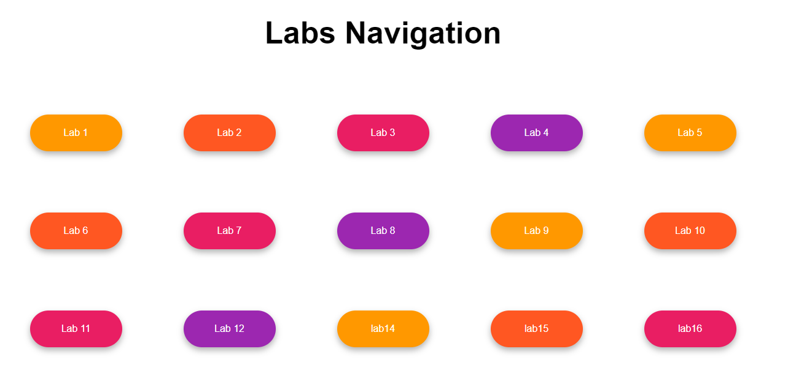

  <strong><h1>🚀 Welcome to the ASP.NET Labs Repository! 🚀</h1></strong>

 

  

<b>Are you ready to embark on an exciting journey into the world of ASP.NET development? Look no further! This repository is your ultimate resource for mastering ASP.NET using VB.NET and unleashing your creativity with web applications.</b>

<h2>🔬 Labs Overview</h2>

Inside this repository, you will find a series of captivating and knowledge-packed lab works. Each lab is carefully crafted to challenge your skills and expand your understanding of ASP.NET. We've covered everything from the basics to advanced concepts, so you can progress at your own pace.

<h3>📁 Lab Structure</h3>

To make your learning experience seamless, we've organized each lab with a comprehensive structure. Here's what you'll find in every lab folder:

<ul>
  <li><strong>📝 LabX-Questions.pdf:</strong> Get ready to tackle real-world scenarios! This file contains thought-provoking questions and detailed requirements for the lab. It's your roadmap to success.</li>
  <li><strong>💻 LabX-Solutions:</strong> Don't worry, we've got your back! This folder houses the solution files for each lab. Dive in and explore the fully functional code that demonstrates how to implement the lab's tasks.</li>
</ul>

<h2>🌐 The Marvelous Web Application</h2>

But wait, there's more! In addition to the labs, we've developed a sensational web application using HTML, CSS, and ASP.NET with VB.NET. Brace yourself for an immersive experience as you witness the power of ASP.NET come to life.

<h4>✨ Key Features ✨</h4>
<ul>
  <li>User authentication and authorization: Safeguard your application with robust security measures.</li>
  <li>Database integration: Seamlessly connect and interact with your data using the magic of databases.</li>
  <li>Dynamic content generation: Transform static web pages into dynamic, interactive experiences.</li>
  <li>Responsive design: Ensure your application looks stunning across all devices and screen sizes.</li>
</ul>

<h2>🚀 Deployment</h2>

Guess what? We've taken the web application a step further by deploying and hosting it on Somee. Get ready to showcase your creation to the world! Access the live application by visiting <a href="http://www.ahmednaseerlabs.somee.com/"  target="_blank">VISIT</a>.

<h2>📚 Getting Started</h2>

Are you excited to get started? We thought so! Follow these simple steps to make the most out of this repository:

<ol>
  <li><strong>Clone or Download:</strong> Grab your own copy of this repository to your local machine using the provided GitHub options.</li>
  <li><strong>Navigate & Explore:</strong> Dive into the lab folders that pique your interest. Open the LabX-Questions.pdf file to unleash the power of curiosity.</li>
  <li><strong>Challenge Accepted:</strong> Feel the adrenaline rush as you conquer the lab tasks. Let your creativity shine, and don't hesitate to push the boundaries.</li>
  <li><strong>Solutions Unveiled:</strong> Once you've completed a lab, head over to the LabX-Solutions folder. Compare your implementation with the provided solutions to gain deeper insights and refine your skills.</li>
  <li><strong>Ignite Innovation:</strong> The code is yours to experiment with! Modify and extend it to unleash your inner innovator. Let your imagination run wild.</li>
</ol>

<h2>🎉 Contributions</h2>

Are you ready to leave your mark on this repository? We welcome contributions with open arms! Whether it's bug fixes, improvements, or new labs, your ideas are valuable. Here's how you can join the adventure:

<ol>
  <li><strong>Fork & Branch:</strong> Start your own journey by forking the repository and creating a new branch for your contributions.</li>
  <li><strong>Make Magic:</strong> Work your coding wizardry and make the desired modifications. Commit your changes with expressive and captivating commit messages.</li>
  <li><strong>Summon the Pull Request:</strong> Cast your spell by pushing your changes to your forked repository. Open a pull request against the main repository and enchant us with an explanation of your remarkable changes.</li>
</ol>

<h2>📜 License</h2>

We believe in the power of open knowledge and collaboration. Therefore, the contents of this repository are provided under the MIT License. Take a moment to review the license file for more information.

<h2>📧 Contact</h2>

Got questions, suggestions, or just want to say hi? We'd love to hear from you! Reach out to us at <a href="codeblooded69@gmail.com">codeblooded69@gmail.com</a>, and let's start a conversation.

Now, fasten your seatbelt, put on your coding cape, and get ready to take your ASP.NET skills to extraordinary heights! Happy coding! 🚀✨

